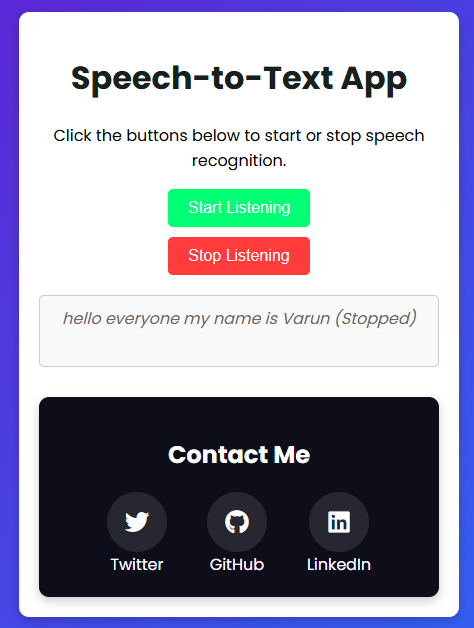

# Speech-to-Text Application

A simple and interactive web application that converts speech into text using the Web Speech API. The application provides a clean user interface, allowing users to start and stop speech recognition with a click of a button.

## Features

- **Real-Time Speech Recognition**: Uses the Web Speech API to transcribe spoken words into text in real time.
- **Responsive Design**: Ensures a great user experience on both desktop and mobile devices.
- **Animated Typing Effect**: The page features a dynamic typing effect for the title.
- **Customizable UI**: Styled with CSS for an engaging look and feel.
- **Social Media Links**: Easily connect with the developer via Twitter, GitHub, and LinkedIn.

## Demo



## Technologies Used

- **HTML**: Structure of the application.
- **CSS**: Styling and responsive design.
- **JavaScript**: Speech recognition logic and interactive features.

## How to Use

1. Clone the repository:
   ```bash
   git clone https://github.com/Varun5711/speech-to-text-app.git
   cd speech-to-text-app
